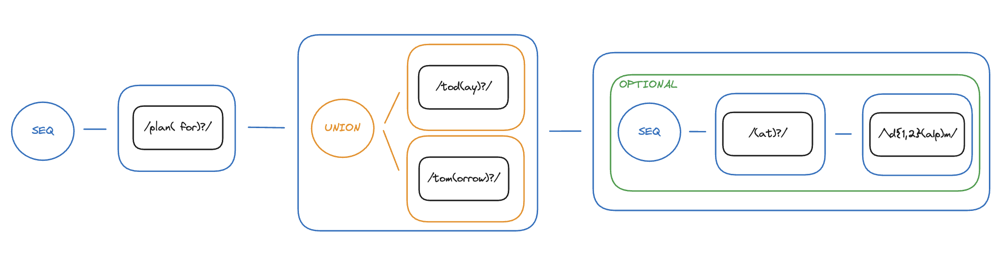

- [Summary](#summary)
- [Defining A Grammar](#defining-a-grammar)
  - [Core Expression Types](#core-expression-types)
    - [Literal Expressions](#literal-expressions)
      - [State-dependent Literal Expressions](#state-dependent-literal-expressions)
    - [Sequence Expressions](#sequence-expressions)
    - [Union Expressions](#union-expressions)
    - [Dynamic Expressions](#dynamic-expressions)
  - [Utility Expression Types](#utility-expression-types)
    - [Optional Expressions](#optional-expressions)
    - [Conditional Expressions](#conditional-expressions)
    - [Permutations Expressions](#permutations-expressions)
  - [Parser Result](#parser-result)


# Summary

Lang-parse supports the definition of custom grammars, and parsing of input strings against those grammars. The terms of the grammar can be augmented with logic to extract semantic state from matching inputs, and logic to provide input suggestions when inputs do not match. With these features you can use lang-parse to interpret and act on your users' natural-language directives, and to power autocompletion and other interactive UXs for entry of such directives. 

What lang-parse **isn't**:
- An AI/ML library
- Intended for processing of general, unstructured natural language input

# Defining A Grammar

A lang-parse grammar is defined by the root node of an *Expression* graph. There are several Expression types that can be composed to form such a graph, as illustrated in figure 1. An input string is evaluated against every possible path through the expression graph, and the evaluation results from the path or paths that match the longest prefix of the input are combined to produce the result returned from the parser, as described in the [Parse Result](#parser-result) section.


*Figure 1: A simple planning grammar*

There are 4 core expression types in lang-parse:
- [Literal](#literal-expressions) Expressions
- [Sequence](#sequence-expressions) Expressions
- [Union](#union-expressions) Expressions
- [Dynamic](#dynamic-expressions) Expresions

Several additional utility expressions are provided to simplify solutions for common scenarios which could be achieved less conveniently using the core expressions alone.
- [Optional](#optional-expressions) Expressions
- [Conditional](#conditional-expressions) Expressions
- [Permutations](#permutations-expressions) Expresssions

Every Expression is evaluated against its input to produce one or more evaluation results, each of which have the following attributes:
- `isMatch`: true if the entire Expression matches some prefix of its input.
- A division of the input into:
  -  `matchingPart`: The (possibly empty) prefix that fully or partially matched the Expression.
  - `remainder`: The (possibly empty) suffix that did not match the Expression.
- `suggestions`: A list of suggestions that correspond to phrases that could be appended to the `matchingPart` to make it longer.
- `state`: The state extracted from the input by the Expression

## Core Expression Types
### Literal Expressions

**Literal** Expressions are the workhorses of your grammar. They are defined by a regular expression that is matched against the start of their input. The match is performed greedily, meaning that if the regex matches multiple prefixes of different lengths, the longest possible match is used. The Expression "consumes" the matching part, so that the remainder of the input becomes the input to the next node in the current branch of the expression graph.

Conceptually, a Literal Expression typically represents an input segment that has some semantic value in the grammar you are defining. As the parser explores a branch of the expression graph, it aggregates state extracted from all of the Literal Expressions in that branch. To contribute to this aggregate state object, each Literal Expression may have a `stateUpdater` function that takes the current state object and the regex match groups as inputs, and updates the state.

For example, given the input "6pm alarm", the following Literal Expression would consume "6pm" as the matching part and would set `state.hour24` to `18`:

```javascript
literal(/(\d{1,2})(a|p)m\b\s*/, {
    stateUpdater: (state, [hourStr, meridiemStr]) => {
        // extract and store the 24-hour-clock hour
        const hour = parseInt(hourStr) % 12;
        const hour24 = meridiemStr === 'a' ? hour : hour + 12;
        state.hour24 = hour24
    } 
})
```


> [!NOTE]
> We typically use the regex term `\b\s*` at the end of literal expressions' regexes to ensure that the expression only matches full words, and consumes any whitespace that follows the last matching word. Without this suffix, a regex like `(\d{1,2})(a|p)m` would also match the input "6pmfoo".

When a Literal Expression does *not* match its input, it can contribute suggestions of inputs that *would* match it.

For example, given the input "6 A.M.", the following Literal Expression would not match, and would contribute "6pm" and "10am" as suggestions for input that it would match:

```javascript
literal(/(\d{1,2})(a|p)m\b\s*/, {
    suggestions: ['6pm', '10am]
})
```

These suggestions can be used in an application utilizing lang-parse to teach the user about the grammar, and to provide interactive user experiences like autocompletions. 

#### State-dependent Literal Expressions
The `regex` and `suggestions` of a Literal Expression can also be provided by a function that takes the current state as input. This allows for some more intelligent constraints on the accepted input combinations without having to resort to more complex [Union Expressions](#union-expressions). For a somewhat contrived example, imagine the parser has extracted from earlier nodes in the current expression graph branch a count `i`, and we are now evaluating the following Literal Expression:

```javascript
function possibleTimeUnitsForCount(i) {
    const possibleUnits = ['years'];
    if (i <= 12) {
        possibleUnits.append('months');
    }
    if (i <= 52) {
        possibleUnits.append('weeks');
    }
    if (i <= 365) {
        possibleUnits.append('days');
    }
    return possibleUnits;
}

literal(
    state => {
        const possibleUnits = possibleTimeUnitsForCount(state.i);
        return new RegExp(`(${possibleUnits.join('|')})\b\s*`);
    },
    {
        suggestions: state => possibleTimeUnitsForCount(state.i)
        stateUpdater: (state, [unit]) => state.unit = unit
    }        
)
```

If `i` is 4, then the expression will match (and suggest) "years", "months", "weeks", or "days", but if `i` is 80, then it will only match "years", "weeks" and "days".

### Sequence Expressions

**Sequence** Expressions define an ordered sequence of child Expressions. A Sequence Expression with `n` children `[E_1, E_2, ..., E_n]` matches its input if a prefix of the input can be broken into `n` (possibly zero-length) parts `[P_1, P_2, ..., P_n]` such that `E_i` matches `P_i` for all `1 <= i <= n`.

For example, for the expression:

```javascript
sequence(
    literal(/tod(ay)?\b\s*/, {suggestions: ['today']}),
    literal(/(at\b\s*)?/),
    literal(/(\d{1,2})(a|p)m\b\s*/, {suggestions: ['6pm']}),
)
```
We would see evaluation results as follows:


| Input          | isMatch | matchingPart   | remainder  | suggestions |
| -------------- | ------- | -------------- | ---------- | ----------- |
| "today at 6pm" | true    | "today at 6pm" | ""         | []          |
| "tod 6pm"      | true    | "tod 6pm"      | ""         | []          |
| "tod 6pm foo"  | true    | "tod 6pm"      | "foo"      | []          |
| "tomorrow"     | false   | ""             | "tomorrow" | ["today"]   |
| "today"        | false   | "today"        | ""         | ["6pm"]     |
| "today foo"    | false   | "today"        | "foo"      | ["6pm"]     |


### Union Expressions

**Union** Expressions define two or more child expression alternates. They represent branch points in the Expression Graph, where several alternatives with different semantics exist. A Union Expression produces a result from each of its child expressions. The parser interprets the Union Expression as matching its input the results from _any_ of its child expressions are matching.

Extending the Sequence Expression example above, for the expression:

```javascript
sequence(
    union(
        literal(/tod(ay)?\b\s*/, { suggestions: ['today'] }),
        literal(/tom(orrow)?\b\s*/, { suggestions: ['tomorrow'] }),
    ),
    literal(/(at\b\s*)?/),
    literal(/(\d{1,2})(a|p)m\b\s*/, { suggestions: ['6pm'] }),
)
```

We would see two evaluation results for a given input, corresponding to the two union expression alternates, e.g.

| Input          | Result # | isMatch | matchingPart   | remainder      | suggestions  |
| -------------- | -------- | ------- | -------------- | -------------- | ------------ |
| "today at 6pm" | 1        | true    | "today at 6pm" | ""             | []           |
|                | 2        | false   | ""             | "today at 6pm" | ["tomorrow"] |
| "tom 6pm foo"  | 1        | false   | ""             | "tom 6pm foo"  | ["today]     |
|                | 2        | true    | "tom 6pm"      | "foo"          | []           |
| "yesterday"    | 1        | false   | ""             | "yesterday"    | ["today"]    |
|                | 2        | false   | ""             | "yesterday"    | ["tomorrow"] |
| "tomorrow foo" | 1        | false   | ""             | "tomorrow foo" | ["today"]    |
|                | 2        | true    | "tomorrow"     | "foo"          | ["6pm"]      |

### Dynamic Expressions

**Dynamic** Expressions _generate_ an expression at runtime when encountered by the parser. The choice of expression to generate is based on the state that has been extracted by the parser for previous nodes in the current path through the Expression graph. This similar to the dynamicism of [State-dependent Literal Expressions](#state-dependent-literal-expressions), but even more powerful, in that entirely different types of expressions may be generated based on the state, enabling complex grammars that would be difficult or impossible to create with only the three other core Expression types. Under the hood, the [Conditional](#conditional-expressions) and [Permutations](#permutations-expressions) Utility Expressions are implemented using Dynamic Expressions.


## Utility Expression Types

### Optional Expressions

TODO

### Conditional Expressions

TODO

### Permutations Expressions

TODO

## Parser Result

TODO

